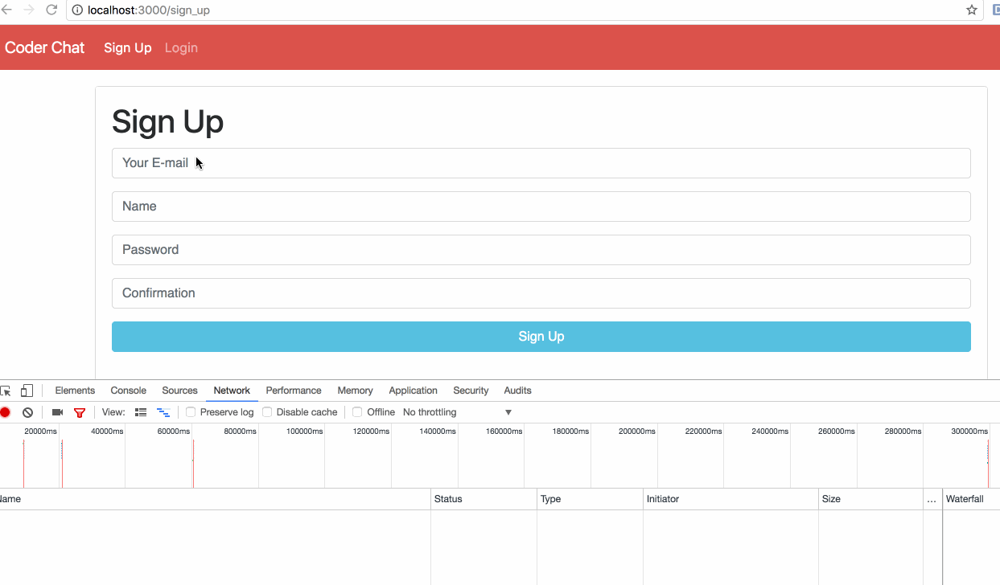

# Homework 2 - *Coder Chat*

**Coder Chat** is a Ruby on Rails application that allows users to send messages to each other that can only be read once.

Submitted by: **Ha Ta**

Time spent: **8** hours

URL: **https://hata-chat.herokuapp.com**

## User Stories

The following **required** functionality is complete:

* [x] User can sign up by providing their email, password, and name.
* [x] User can login using an email and password.
* [x] After logging in, the user is taken to an INBOX page that has a list of incoming messages, sorted in descending chronological order (newest messages at top)
  * Provide a fake "new message" link and a "sent messages" link BUT don't have to make them work yet.
* [x] Unread messages should be **bold** or something similar in the list of messages.
* [ ] Implement "Users" link to take the user to a page that lists all users. Next to/under each user, provide a link to "Add As Friend" to add the user to your list of friends.
* [ ] Implement "New Message" page. The recipient field should be a dropdown, where the options are names from the user's friends.
* [ ] Implement "Sent Messages" page. It lists messages you have sent. Each message should display at what time it was read by the recipient, or "unread".
* [ ] User can read a message's content only once. Once the message has been read, the user will see a page indicating the message has already been read.
* [ ] User can only read messages where they are the recipient.

The following **optional** functionality is complete:

* [ ] User can attach an image.
* [ ] User can have multiple recipients on one message. 
* [ ] User can log in with Facebook.
* [ ] User can also log in with GitHub.
* [ ] User A can "block" User B. If User A blocks User B, they will not see messages from User B. User B will not know they have been blocked.
* [ ] User can remove friends from their friends list.
* [ ] User can unblock friends from their block list.
* [ ] Generate more than 100 messages for a user and only display 20 messages at first. Implement Infinite Scroll so that the user can keep scrolling down for more messages. Hint: you can use the [kaminari gem](https://github.com/amatsuda/kaminari) and [jquery-infinite-pages gem](https://github.com/magoosh/jquery-infinite-pages).
* [ ] User gets an email when they receive a message, with a link to view the message.
* [ ] User can send a message to the email address of a non-registered user. The recipient will receive an email with a link to sign up for the service, and after creating an account, will be able to view the sent message. 

The following **additional** features are implemented:

- [ ] (List anything else that you can get done to improve the app functionality!)

## Video Walkthrough 

Here's a walkthrough of implemented user stories:

GIF created with [LiceCap](http://www.cockos.com/licecap/).

## Notes

Describe any challenges encountered while building the app.

## License

    Copyright [yyyy] [name of copyright owner]

    Licensed under the Apache License, Version 2.0 (the "License");
    you may not use this file except in compliance with the License.
    You may obtain a copy of the License at

        http://www.apache.org/licenses/LICENSE-2.0

    Unless required by applicable law or agreed to in writing, software
    distributed under the License is distributed on an "AS IS" BASIS,
    WITHOUT WARRANTIES OR CONDITIONS OF ANY KIND, either express or implied.
    See the License for the specific language governing permissions and
    limitations under the License.